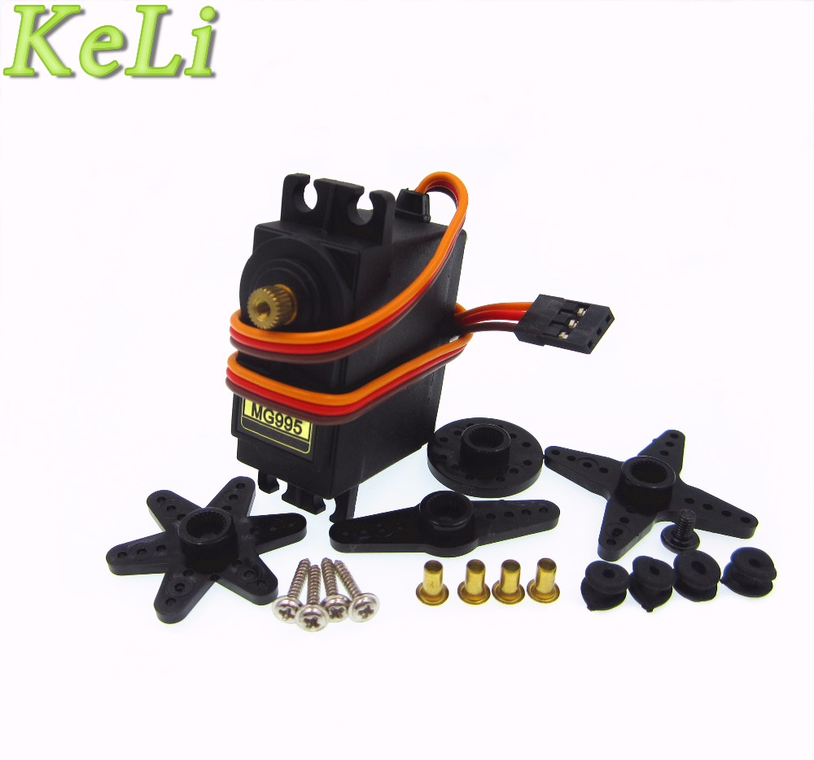

# 6DOF-Arm

Montaje de un brazo robótico de alumnino con 6 grados de libertad

[Brazo robótico (51€ la estructura en alumnino)](https://www.banggood.com/es/DIY-6DOF-Aluminum-Robot-Arm-6-Axis-Rotating-Mechanical-Robot-Arm-Kit-p-1085275.html)

[Guía de montaje](https://drive.google.com/file/d/0Bzr4U7GOGvNJWHJMbGhvbFlMQm8/view?usp=sharing)

Servo: Requiere 2 servos micro como MG90S,
Y cuatro servos estándar del robot tales como, MG995, MG996
O servo digital como DS3218 KS3518 (no incluido)

[5xservos MG995 17,08](https://es.aliexpress.com/store/product/5pcs-lot-NEW-MG995-Metal-Gear-High-Torque-Servo-for-HPI-XL-Helicopter-Car-Boat-Hot/1280487_1965956890.html)

[5x servos MG90 8x16€](https://es.aliexpress.com/store/product/TIEGOULI-5-unids-lote-MG90S-Metal-gear-Digital-9g-Servo-Para-Rc-Helic-ptero-Del-coche/1280487_32673297329.html)

## Pinza robotica

### [Modelo 1 (2 dedos) 10,90€](https://www.banggood.com/Metal-Gripper-Robot-Arm-Manipulator-Gripper-Claw-p-1016810.html?rmmds=search)

[Usa servos MG995,MG996,MG946 SG5010](https://forum.banggood.com/forum-topic-118685.html)

### [Modelo 2 (desliza) 12,95€](https://es.aliexpress.com/store/product/F05602-Robot-Clamp-Gripper-Bracket-Servo-Mount-Mechanical-Claw-Arm-kit-For-MG995-MG996-SG5010-Servo/100989_967852325.html?spm=a219c.search0204.3.1.9MGqGY&ws_ab_test=searchweb0_0,searchweb201602_4_10152_10065_10151_10068_10344_10342_10343_10340_10341_10307_10301_5600020_10303_10060_10155_10154_10056_10055_10054_10059_10534_10533_10532_100031_10099_10338_10339_10103_10102_5590020_10109_10052_10053_10107_10050_10142_10051_10084_10083_5370020_10080_10082_10081_10110_10111_10176_10112_10113_10114_10312_10313_10314_10184_10078_10079_10073,searchweb201603_25,ppcSwitch_2_ppcChannel&btsid=0e66fa05-ba35-4c8e-9e54-e0ad97cafca8&algo_expid=84f8478e-399b-4a50-8222-9d153f6bf360-0&algo_pvid=84f8478e-399b-4a50-8222-9d153f6bf360)

Usa sevos MG995/MG996/SG5010, apoyoHitec/Parallax Futaba/TowerPro servo de la serie,etc 40 × 20 × 36mm

## [Control](./Control.md)
